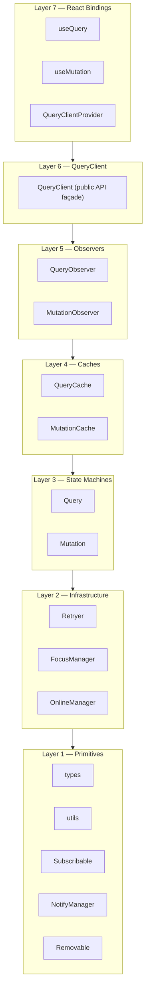
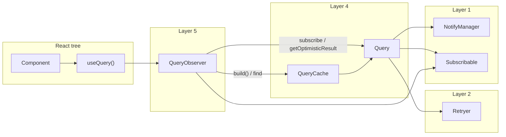
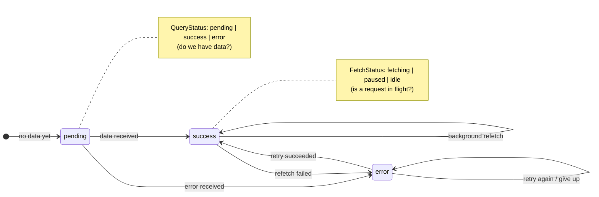
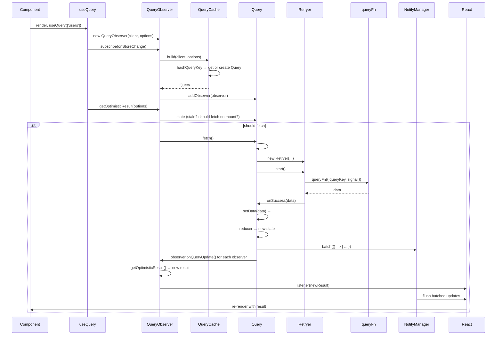
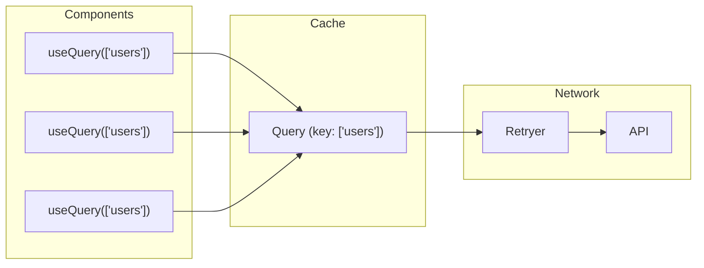
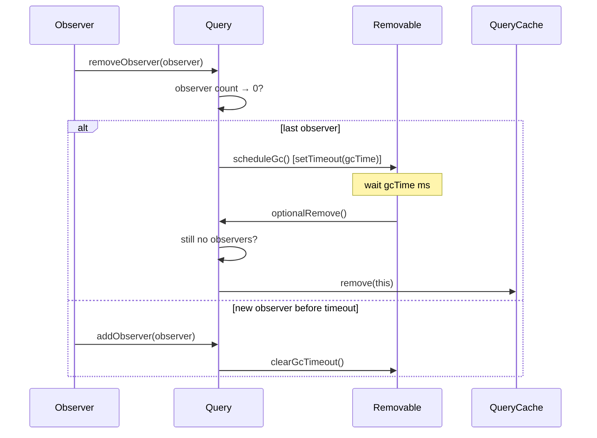
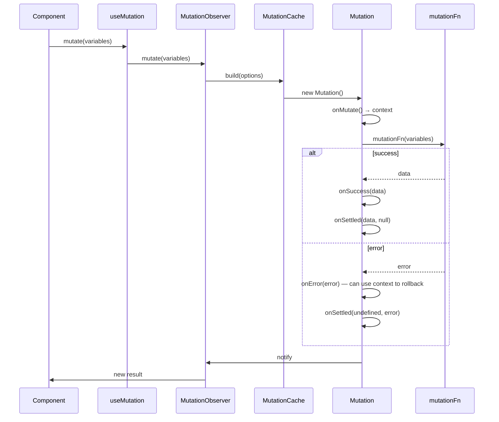

# TanStack Query From Scratch — Complete Project Overview

This document explains the **entire project** in one place: what it is, how it’s built, and how data flows from a React component to the server and back. It includes Mermaid diagrams for the architecture, components, and full request flow.

---

## 1. What This Project Is

This repo is a **from-scratch TypeScript reimplementation** of [TanStack Query](https://tanstack.com/query) (formerly React Query). The goal is **educational**: to understand async state management, the observer pattern, request deduplication, and React 18 internals by building the core yourself.

- **Not** a drop-in replacement — it’s a learning artifact.
- **No** copying of the original source; only the public API and behavior were used as a spec.
- **137 tests**, 0 TypeScript errors, 0 ESLint warnings.

**Problems it solves (that every React + server app hits):**

| Problem | How this project handles it |
|--------|------------------------------|
| Duplicate requests | Same `queryKey` → one shared `Query` → one network call (request deduplication) |
| Stale data | `staleTime`, background refetch, focus/online refetch |
| Loading state mess | Single `QueryState` with derived flags: `isLoading`, `isRefetching`, etc. |
| “Do we show spinner or old data?” | Dual-axis state: `QueryStatus` (data) + `FetchStatus` (network) |
| N re-renders for N observers | `notifyManager` batches all observer callbacks into one React render |
| Data when user navigates back | Deferred GC: data stays in cache for `gcTime` after last observer leaves |
| Optimistic updates | Mutation lifecycle: `onMutate` → context → `onError`/`onSettled` for rollback |
| Retries | `Retryer` with exponential backoff and cancellation |

---

## 2. The 7-Layer Architecture

The system is split into **7 layers**. Each layer **only depends on the layer below**. Nothing in Layer 1 imports from Layer 2; nothing in Layer 4 imports from Layer 5.

**What each layer does:**

| Layer | Responsibility |
|-------|----------------|
| **1 — Primitives** | Types, `hashQueryKey`/`matchesQueryKey`, observer base (`Subscribable`), notification batching (`NotifyManager`), GC base (`Removable`). No React, no network. |
| **2 — Infrastructure** | `Retryer` (retries, backoff, cancel), `FocusManager` (tab focus), `OnlineManager` (navigator.onLine). |
| **3 — State Machines** | `Query` (cache entry + reducer + fetch lifecycle) and `Mutation` (one-off async action + lifecycle hooks). |
| **4 — Caches** | `QueryCache` = Map of `Query` by key; `MutationCache` = Map of `Mutation`. Single source of truth, event emission. |
| **5 — Observers** | `QueryObserver` / `MutationObserver`: bridge from cache entry to “something that subscribes.” Compute rich result (e.g. `QueryObserverResult`), decide when to refetch. |
| **6 — QueryClient** | Public API: `fetchQuery`, `getQueryData`, `setQueryData`, `invalidateQueries`, `cancelQueries`, etc. Holds both caches; on mount subscribes to focus/online. |
| **7 — React Bindings** | `QueryClientProvider`, `useQuery`, `useMutation`. Use `useSyncExternalStore` + observer; no direct cache access. |

---

## 3. Main Components and How They Connect

- **QueryCache**: Only place that creates `Query` (via `build()`). Map key = `hashQueryKey(queryKey)`.
- **Query**: One per logical “query key.” Holds state (reducer), runs fetch via `Retryer`, extends `Subscribable` (observers) and `Removable` (GC).
- **QueryObserver**: One per `useQuery` call. Subscribes to a `Query`, computes `QueryObserverResult`, decides refetch (mount, focus, reconnect, interval).
- **useQuery**: Gets `QueryClient` from context, creates/gets `QueryObserver`, uses `useSyncExternalStore(observer.subscribe, getSnapshot, getServerSnapshot)` and syncs options in `useEffect`.

---

## 4. Query State: Two Axes

State is split into two independent axes so “we have data” and “a request is in flight” can vary independently (e.g. background refetch).

| You have… | Meaning |
|-----------|--------|
| `status: 'success'`, `fetchStatus: 'idle'` | Fresh data, no request. |
| `status: 'success'`, `fetchStatus: 'fetching'` | Background refetch: show current data, no spinner. |
| `status: 'pending'`, `fetchStatus: 'fetching'` | First load: show loading. |
| `status: 'error'`, `fetchStatus: 'fetching'` | Retrying after error. |

Derived flags like `isLoading` and `isRefetching` are computed from these two axes in the observer result.

---

## 5. End-to-End Flow: One `useQuery` Call

This is the full path from “component renders with `useQuery(['users'])`” to “component re-renders with data.”

**Step-by-step (short):**

1. Component renders → `useQuery(['users'])` runs.
2. `useQuery` creates (or reuses) a `QueryObserver` and subscribes to it via `useSyncExternalStore`.
3. Observer gets the right `Query` from `QueryCache.build()` (same key ⇒ same `Query` instance).
4. Observer subscribes to that `Query` (`addObserver`).
5. `getOptimisticResult(options)` runs (for snapshot). Observer decides: stale or should fetch on mount? If yes → `query.fetch()`.
6. `Query.fetch()`: if no in-flight fetch, creates `Retryer`, dispatches `fetch`, runs `queryFn`.
7. `queryFn` resolves → Retryer `onSuccess(data)` → `Query.setData(data)` → `#dispatch({ type: 'success', data })`.
8. Reducer updates state; `Query` notifies all observers inside `notifyManager.batch()`.
9. Each observer’s `onQueryUpdate()` runs; they notify their listeners (the one from `useSyncExternalStore`).
10. Batched flush runs → React sees store change → re-reads snapshot → component re-renders with new result.

---

## 6. Request Deduplication and Notifications

**Deduplication:** Many components, same key ⇒ one `Query` ⇒ one `fetch()`. If `fetch()` is already in progress, it returns the **same** `Retryer.promise`; no second network call.

**Notification batching:** One state change (e.g. one fetch success) can trigger many observer callbacks. Without batching, each would schedule a React update → N re-renders. `NotifyManager` queues those callbacks and flushes them once (e.g. in one `setTimeout(0)` or React’s batch), so you get **one** render for that event.

---

## 7. Garbage Collection (Deferred Removal)

Queries are not removed as soon as the last component unmounts. They stay for `gcTime` (e.g. 5 minutes). If the user comes back within that window, the same `Query` is still in the cache and can show data immediately (and optionally refetch in the background).

---

## 8. Mutation Flow (Simplified)

Mutations don’t cache by key; they’re one-off actions. Lifecycle: `onMutate` (optional optimistic update) → `mutationFn` → `onSuccess` or `onError` → `onSettled`. The return value of `onMutate` is passed as `context` to `onError` and `onSettled` so you can roll back.

---

## 9. Design Patterns Used

| Pattern | Where | Purpose |
|--------|--------|--------|
| **Observer (pub/sub)** | `Subscribable` | Decouple state changes from who reacts (Query ↔ observers, cache ↔ DevTools). |
| **State machine** | `Query` / `Mutation` reducer | All transitions in one pure function; easy to test and reason about. |
| **Deferred GC** | `Removable` | Keep data for `gcTime` after last observer; fast back-navigation. |
| **Request deduplication** | `Query.fetch()` + `Retryer.promise` | N observers ⇒ 1 network request. |
| **Notification batching** | `NotifyManager` | N state changes ⇒ 1 React render. |
| **Façade** | `QueryClient` | Single public API over caches and options. |
| **useSyncExternalStore** | `useQuery` / `useMutation` | Safe subscription to external store (no tearing, SSR-friendly). |
| **Context threading** | Mutation `onMutate` → `onError` / `onSettled` | Optimistic updates and rollback. |
| **Interfaces to break cycles** | `QueryCacheInterface` in `query.ts`, etc. | Avoid circular imports while keeping type safety. |

---

## 10. File Map (Where to Look)

| Layer | Files |
|-------|--------|
| 1 | `types.ts`, `utils.ts`, `subscribable.ts`, `notifyManager.ts`, `removable.ts` |
| 2 | `retryer.ts`, `focusManager.ts`, `onlineManager.ts` |
| 3 | `query.ts`, `mutation.ts` |
| 4 | `queryCache.ts`, `mutationCache.ts` |
| 5 | `queryObserver.ts`, `mutationObserver.ts` |
| 6 | `queryClient.ts` |
| 7 | `QueryClientProvider.tsx`, `useQuery.ts`, `useMutation.ts`, `useQueryClient.ts` |

For more detail: **ARCHITECTURE.md** (per-file walkthrough of every layer).

---

## Summary

- **What:** A from-scratch TanStack Query–style library in TypeScript for learning.
- **How:** 7 layers (Primitives → Infrastructure → State Machines → Caches → Observers → QueryClient → React Bindings), with observer pattern, pure reducers, request deduplication, notification batching, and deferred GC.
- **Flow:** Component → `useQuery` → `QueryObserver` → `QueryCache.build()` → `Query` → `Retryer` → `queryFn`; state updates go through reducer → observers → `NotifyManager` → one React render.

The Mermaid diagrams above (layers, components, sequence, state, GC, mutation) give a visual map of this flow and how the pieces fit together.
