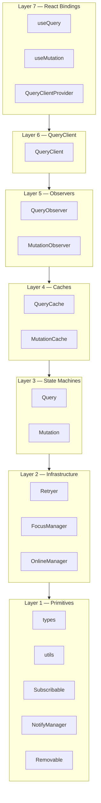
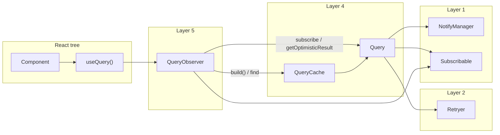
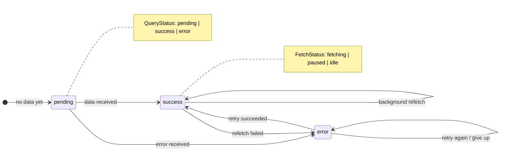
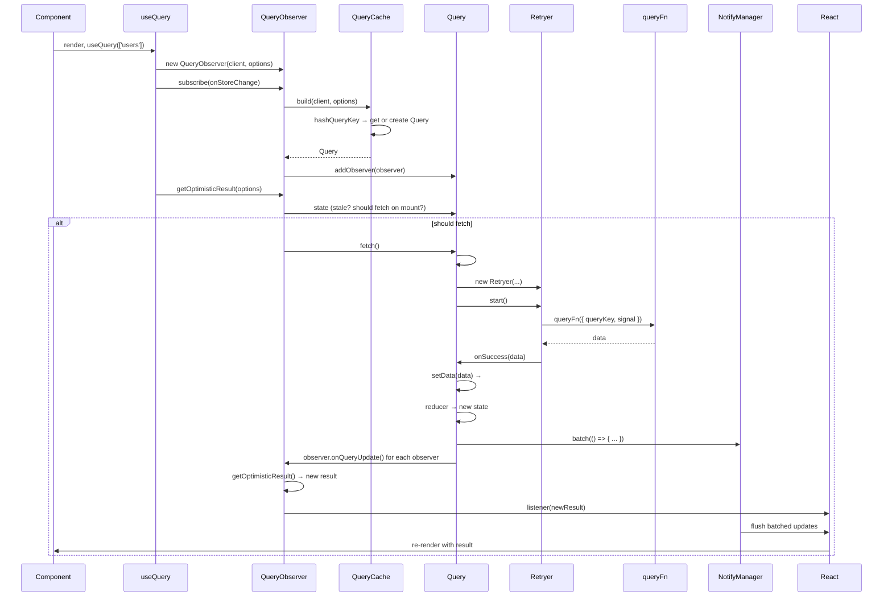
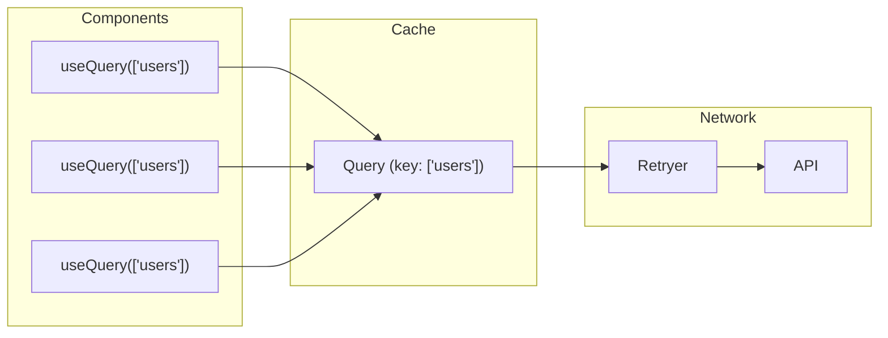
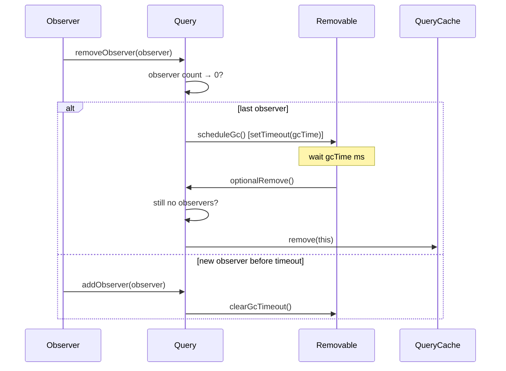
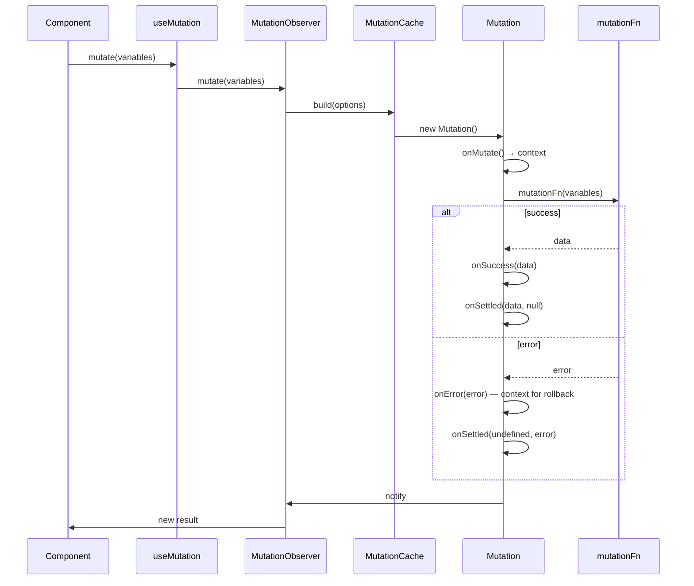

# TanStack Query — From Scratch

A from-scratch TypeScript implementation of [TanStack Query](https://tanstack.com/query) for learning: async state management, observer pattern, request deduplication, and React internals. Educational project — not a drop-in replacement.

**Problems it solves:**

| Problem                       | How this project handles it                                               |
| ----------------------------- | ------------------------------------------------------------------------- |
| Duplicate requests            | Same `queryKey` → one shared `Query` → one network call                   |
| Stale data                    | `staleTime`, background refetch, focus/online refetch                     |
| Loading state mess            | Single `QueryState` with derived flags: `isLoading`, `isRefetching`, etc. |
| “Spinner or old data?”        | Dual-axis state: `QueryStatus` (data) + `FetchStatus` (network)           |
| N re-renders for N observers  | `notifyManager` batches callbacks → one React render                      |
| Data when user navigates back | Deferred GC: data stays for `gcTime` after last observer                  |
| Optimistic updates            | Mutation: `onMutate` → context → `onError`/`onSettled` for rollback       |
| Retries                       | `Retryer` with exponential backoff and cancellation                       |

---

## Contents

- [TanStack Query — From Scratch](#tanstack-query--from-scratch)
  - [Contents](#contents)
  - [Architecture (7 layers)](#architecture-7-layers)
  - [Components and how they connect](#components-and-how-they-connect)
  - [Query state: two axes](#query-state-two-axes)
  - [Request lifecycle (useQuery)](#request-lifecycle-usequery)
  - [Request deduplication](#request-deduplication)
  - [Garbage collection (deferred removal)](#garbage-collection-deferred-removal)
  - [Mutation flow (simplified)](#mutation-flow-simplified)
  - [Design patterns](#design-patterns)
  - [File map](#file-map)
  - [Getting started](#getting-started)
  - [Documentation](#documentation)
  - [Tech stack](#tech-stack)

---

## Architecture (7 layers)

Each layer only depends on the one below it.



| Layer                  | Responsibility                                                                        |
| ---------------------- | ------------------------------------------------------------------------------------- |
| **1 — Primitives**     | Types, `hashQueryKey`/`matchesQueryKey`, `Subscribable`, `NotifyManager`, `Removable` |
| **2 — Infrastructure** | `Retryer`, `FocusManager`, `OnlineManager`                                            |
| **3 — State Machines** | `Query`, `Mutation` (reducer + fetch/mutation lifecycle)                              |
| **4 — Caches**         | `QueryCache`, `MutationCache` — Map by key, event emission                            |
| **5 — Observers**      | `QueryObserver`, `MutationObserver` — bridge to React, compute result, decide refetch |
| **6 — QueryClient**    | Public API: `fetchQuery`, `getQueryData`, `invalidateQueries`, etc.                   |
| **7 — React Bindings** | `QueryClientProvider`, `useQuery`, `useMutation` — `useSyncExternalStore` + observer  |

---

## Components and how they connect



- **QueryCache** — Only place that creates `Query` (via `build()`). Key = `hashQueryKey(queryKey)`.
- **Query** — One per query key. State (reducer), fetch via `Retryer`, extends `Subscribable` + `Removable`.
- **QueryObserver** — One per `useQuery`. Subscribes to `Query`, computes `QueryObserverResult`, decides refetch.
- **useQuery** — Context → `QueryObserver` → `useSyncExternalStore(subscribe, getSnapshot, getServerSnapshot)`.

---

## Query state: two axes

“Do we have data?” and “Is a request in flight?” are independent.



| status + fetchStatus   | Meaning                                     |
| ---------------------- | ------------------------------------------- |
| `success` + `idle`     | Fresh data, no request.                     |
| `success` + `fetching` | Background refetch — show data, no spinner. |
| `pending` + `fetching` | First load — show loading.                  |
| `error` + `fetching`   | Retrying after error.                       |

---

## Request lifecycle (useQuery)

From “component renders with `useQuery(['users'])`” to “component re-renders with data.”



**Short:** Component → useQuery → QueryObserver → QueryCache.build() → Query → Retryer → queryFn → success → dispatch → reducer → notify observers → batch → one re-render.

---

## Request deduplication

Many components, same key ⇒ one `Query` ⇒ one `fetch()`. In-flight fetch returns the same `Retryer.promise`.



**Notification batching:** One state change can trigger many observer callbacks. `NotifyManager` queues and flushes them once → one React render.

---

## Garbage collection (deferred removal)

Queries stay in cache for `gcTime` after the last observer unsubscribes. Re-mount within that window → data still there (and optional refetch).



---

## Mutation flow (simplified)

One-off actions. Lifecycle: `onMutate` (optional optimistic update) → `mutationFn` → `onSuccess` or `onError` → `onSettled`. `onMutate` return value is `context` for rollback in `onError`/`onSettled`.



---

## Design patterns

| Pattern                   | Where                                       | Purpose                                |
| ------------------------- | ------------------------------------------- | -------------------------------------- |
| **Observer (pub/sub)**    | `Subscribable`                              | Decouple state changes from who reacts |
| **State machine**         | `Query` / `Mutation` reducer                | Pure transitions, easy to test         |
| **Deferred GC**           | `Removable`                                 | Fast back-navigation within `gcTime`   |
| **Request deduplication** | `Query.fetch()` + `Retryer.promise`         | N observers ⇒ 1 network request        |
| **Notification batching** | `NotifyManager`                             | N state changes ⇒ 1 React render       |
| **Façade**                | `QueryClient`                               | Single public API                      |
| **useSyncExternalStore**  | `useQuery` / `useMutation`                  | Tearing-safe, SSR-friendly             |
| **Context threading**     | Mutation `onMutate` → `onError`/`onSettled` | Optimistic updates + rollback          |

---

## File map

| Layer | Files                                                                           |
| ----- | ------------------------------------------------------------------------------- |
| 1     | `types.ts`, `utils.ts`, `subscribable.ts`, `notifyManager.ts`, `removable.ts`   |
| 2     | `retryer.ts`, `focusManager.ts`, `onlineManager.ts`                             |
| 3     | `query.ts`, `mutation.ts`                                                       |
| 4     | `queryCache.ts`, `mutationCache.ts`                                             |
| 5     | `queryObserver.ts`, `mutationObserver.ts`                                       |
| 6     | `queryClient.ts`                                                                |
| 7     | `QueryClientProvider.tsx`, `useQuery.ts`, `useMutation.ts`, `useQueryClient.ts` |

---

## Getting started

**Prerequisites:** Node.js 18+

```bash
npm install
npm run dev      # Interactive demo
npm test         # Run tests
npm run build    # Production build
```

---

## Documentation

- **[PROJECT_OVERVIEW.md](./PROJECT_OVERVIEW.md)** — Full narrative and the same diagrams in context.
- **[ARCHITECTURE.md](./ARCHITECTURE.md)** — Per-file walkthrough of every layer.

---

## Tech stack

TypeScript 5.6 · React 18.3 · Vite 6 · Vitest 2 · ESLint + Prettier
